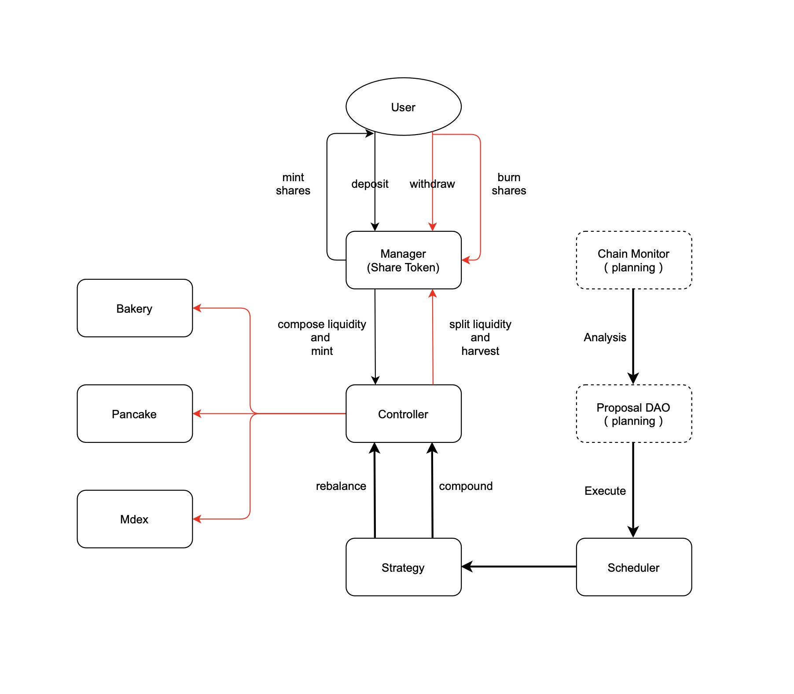

# VaultManager

VaultManager is the auto vaults for liquidity providers.

## Architecture and Flow




## Contracts Architecture

### Code Tree

```sh
├── VaultController.sol
├── VaultManager.sol
├── VaultStrategy.sol
└── interfaces
    ├── IController.sol
    ├── IManager.sol
    ├── IStrategy.sol
    ├── master
    │   ├── IBakeryMaster.sol
    │   ├── IMdexMaster.sol
    │   └── IPancakeMaster.sol
    └── swap
        ├── ISwapV2Factory.sol
        ├── ISwapV2Pair.sol
        └── ISwapV2Router.sol
```


### VaultManager

VaultManager manage the user's deposit and withdraw, and to ensure the correctness of the calculation of the principal and interest.

Contract principal function:
- deposit 
- withdraw


### VaultController

VaultController is the scheduling contract for liquidity mining for specified master contracts, which is the scheduling control center by the administrator.

Contract principal function:
- approveTo 
- depositToPool
- withdrawFromPool
- split
- compose
- migrate
- swap


### VaultStrategy

VaultStrategy is the strategy for auto vaults, which facilitates the administrator to operate the controller based on the chain statistical data to maximize revenue.

Contract principal function:
- harvest 
- convertReward
- convertRemain
- rebalance


## BSC Testnet

BSC testnet contract address:

VaultManager: `0x2dDF95b3E31436633ee96CDd702e68Bea7e388a3`

VaultController: `0xC80bFE01F89A6614a354b2010b7192c3d3C49D56`

VaultStrategy: `0xe3A4dB6f3eeb80c540f21e02771183a0d8D0Aa98`